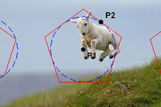

This is part tutorial and part example. The goal was to build a toolchain to help myself, and others, write AWS Lambda handlers without the configuration bogging me down. It was created for the [2016 CUGOS Spring Fling](http://cugos.org/2016-spring-fling/). Included is a build of the [AWS S3 Lambda tutorial](http://docs.aws.amazon.com/lambda/latest/dg/with-s3-example.html). A more in-depth example will be created showing a basic geoprocessing pipeline. Everything uses the provisioning tool Ansible because working with AWS configuration can lead to boredom and death. A few people asked why this was built with Ansible. If you feel this way, then please read the [Why Ansible](#why-ansible) section.

## Getting Started
0. install `python-virtualenv` for your OS environment. Create a virtualenv

    ```bash
    DEFAULT_PY=$(which python)
    $ virtualenv --python=$DEFAULT_PY venv
    $ source venv/bin/activate
    ```
0. pip install -r requirements

## Create an IAM User to Run the Examples
0. we won't want to run these examples as the AWS root account, so let's create a new IAM user
0. first, login to your AWS account and go to Account > Security Credentials > Access Keys
0. either use your existing root account keys or create and activate new ones
0. create a shell script with your Access Key and Access Secret called `aws_creds.sh`

    ```bash
    export AWS_ACCESS_KEY_ID=ABCDEFGHIJKLMN
    export AWS_SECRET_ACCESS_KEY=A+BCDEFGHIJK/LMN
    ```

0. add environment variables for the new IAM user you'll be creating

    ```bash
    export AWS_ACCESS_KEY_ID=ABCDEFGHIJKLMN
    export AWS_SECRET_ACCESS_KEY=A+BCDEFGHIJK/LMN
    # new lines
    export IAM_USER_NAME=cugos
    export IAM_USER_PASSWORD=cugos
    ```
0. source it

    ```bash
    $ source aws_creds.sh
    ```
0. now create a new IAM user by running the following command. Note, this creates a user with AdminAccess policy which is not much better than the root account. To restrict the permissions override the policy json and `policy_path` in `overrides/iam_user_vars.yml`

    ```bash
    $ ansible-playbook -i devops/inventories/dynamic  devops/iam_create_user.yml
    ```
0. there should be a `new_aws_creds.sh` file created in the root directory with this new user's access keys and secrets as well as an account number:

    ```bash
    export IAM_USER_NAME="cugos"
    export IAM_USER_PASSWORD="cugos"
    export AWS_ACCESS_KEY_ID=ABCDEFGHIJKLMN
    export AWS_SECRET_ACCESS_KEY=A+BCDEFGHIJK/LMN
    export AWS_ACCOUNT_ID=123456789
    ```
0. these are the credentials we're going to want to use for the rest of the examples so source this:

    ```bash
    $ source new_aws_creds.sh
    ```

## Run the AWS Lambda with Amazon S3 Tutorial Example
0. this example is a build of the [AWS S3 Lambda tutorial](http://docs.aws.amazon.com/lambda/latest/dg/with-s3-example.html)
0. this example is running off a set of default config variables declared in `devops/group_vars/*.yml`. if you want to override one of these then copy and paste it into `overrides/aws_with_amazon_s3_tutorial_vars.yml`. Note, the only default variable that you *have to change* is the `centos_ssh_public_key` which determines how you ssh into the ec2 build box. Read more about that in (creating-ssh-keys)[#create ssh keys]
0. then run this ansible playbook for the tutorial and cross your fingers.

    ```bash
    $ ansible-playbook -i devops/inventories/dynamic \
        devops/run_aws_lambda_with_s3_tutorial.yml --private-key=./private.pem -u ec2-user
    ```

0. an overview of things this command does:
    0. creates an ec2 instance with key pairs, wide open security groups and elastic ips
    0. creates S3 buckets with correct permissions and notification policies for events
    0. uses the ec2 instance to build our lambda dependencies and lambda handler into a zipfile
    0. creates a Lambda function service from our built zipfile
    0. creates the correct IAM roles and permissions for S3 to invoke our Lambda function and for Lambda to access S3

0. when it's done running go and test it by uploading a bunch of Lolz cats that should be resized

    ```bash
    $ ansible-playbook \
        -i devops/inventories/dynamic \
        devops/test_aws_lambda_with_s3_tutorial.yml
    ```

## Run the Geospatial Job Queue Example
0. nothing yet

## Why Ansible
A few people have asked why this wasn't built with shell scripts around AWS CLI commands, wrapping boto calls outright or using AWS CloudFormation tools. Ansible already wraps a lot of boto and a good number of commands are already idempotent. An additional upsell was getting to work with the great [Ansible Lambda wrappers](https://github.com/pjodouin/ansible-lambda).

## Creating SSH Keys
You need to create a [passwordless ssh key pair](http://www.linuxproblem.org/art_9.html) to log into your ec2 instance. The public key will be loaded onto the ec2 box. The private key will stay local and the path will be pointed to when you run Ansible commands with the `--private-key` flag. The only you have to do is `cat` your public key and then replace the  `centos_ssh_public_key` variable that exists in `devops/group_vars/all.yml` with your new public key. *MAKE SURE IT IS INSERTED IN THE POSITION IT WAS BEFORE -- SAME NUMBER OF SPACES AT FRONT OF THE LINE, NO SPACES AT THE END*

## TODO
0. use the new iam module with role from ansible-lambda
0. make sure that we do the `apt-get install` part as dynamic in build on ec2 for create build machine
0. create basic geoprocessing example: GeoJSON polygons in, buffer, merge, zipped shapefile out
0. write tear-down script

